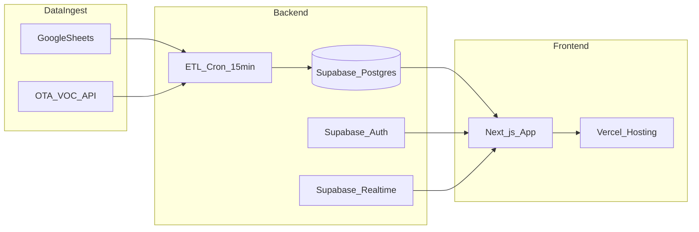
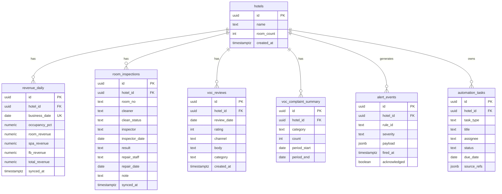

# ERD · Phase 2 아키텍처

> **버전:** v0.1 | **대상:** Next.js (Vercel) + Supabase Postgres

---

## 1. 아키텍처 개요



| 계층 | 기술 | 역할 |
|------|------|------|
| Ingest | Google Sheets API / CSV | 매출·객실 원천 |
| ETL | Vercel Cron / Supabase Edge Functions | 15분 주기 upsert |
| DB | Supabase Postgres | 정규화·집계·RLS |
| API | Next.js Route Handlers | 대시보드 JSON API |
| UI | Next.js + React | Vercel 배포, 모바일 PWA |
| Auth | Supabase Auth | 경영진·운영팀 역할 (2차) |

---

## 2. ERD



### 2.1 인덱스·제약

- `revenue_daily (hotel_id, business_date)` UNIQUE
- `room_inspections (hotel_id, room_no, inspector_date)` INDEX
- `voc_reviews (hotel_id, review_date)` INDEX
- RLS: `hotel_id = auth.jwt() ->> 'hotel_id'` (tenant 격리)

---

## 3. Supabase Migration SQL

파일: `supabase/migrations/001_initial_schema.sql` (Phase 2 구현 시)

```sql
-- hotels
CREATE TABLE hotels (
  id UUID PRIMARY KEY DEFAULT gen_random_uuid(),
  name TEXT NOT NULL,
  room_count INT DEFAULT 150,
  created_at TIMESTAMPTZ NOT NULL DEFAULT now()
);

-- revenue_daily
CREATE TABLE revenue_daily (
  id UUID PRIMARY KEY DEFAULT gen_random_uuid(),
  hotel_id UUID NOT NULL REFERENCES hotels(id) ON DELETE CASCADE,
  business_date DATE NOT NULL,
  occupancy_pct NUMERIC(5,2),
  room_revenue NUMERIC(14,2) NOT NULL DEFAULT 0,
  spa_revenue NUMERIC(14,2) NOT NULL DEFAULT 0,
  fb_revenue NUMERIC(14,2) NOT NULL DEFAULT 0,
  total_revenue NUMERIC(14,2) NOT NULL DEFAULT 0,
  synced_at TIMESTAMPTZ NOT NULL DEFAULT now(),
  UNIQUE (hotel_id, business_date)
);

CREATE INDEX idx_revenue_daily_hotel_date ON revenue_daily (hotel_id, business_date DESC);

-- room_inspections
CREATE TABLE room_inspections (
  id UUID PRIMARY KEY DEFAULT gen_random_uuid(),
  hotel_id UUID NOT NULL REFERENCES hotels(id) ON DELETE CASCADE,
  room_no TEXT NOT NULL,
  cleaner TEXT,
  clean_status TEXT,
  inspector TEXT,
  inspector_date DATE,
  result TEXT,
  repair_staff TEXT,
  repair_date DATE,
  note TEXT,
  synced_at TIMESTAMPTZ NOT NULL DEFAULT now()
);

CREATE INDEX idx_room_inspections_hotel ON room_inspections (hotel_id, inspector_date DESC);

-- voc_reviews
CREATE TABLE voc_reviews (
  id UUID PRIMARY KEY DEFAULT gen_random_uuid(),
  hotel_id UUID NOT NULL REFERENCES hotels(id) ON DELETE CASCADE,
  review_date DATE,
  rating INT CHECK (rating BETWEEN 1 AND 5),
  channel TEXT,
  body TEXT,
  category TEXT,
  created_at TIMESTAMPTZ NOT NULL DEFAULT now()
);

-- voc_complaint_summary
CREATE TABLE voc_complaint_summary (
  id UUID PRIMARY KEY DEFAULT gen_random_uuid(),
  hotel_id UUID NOT NULL REFERENCES hotels(id) ON DELETE CASCADE,
  category TEXT NOT NULL,
  count INT NOT NULL DEFAULT 0,
  period_start DATE,
  period_end DATE
);

-- alert_events
CREATE TABLE alert_events (
  id UUID PRIMARY KEY DEFAULT gen_random_uuid(),
  hotel_id UUID NOT NULL REFERENCES hotels(id) ON DELETE CASCADE,
  rule_id TEXT NOT NULL,
  severity TEXT NOT NULL CHECK (severity IN ('critical', 'warning', 'info')),
  payload JSONB NOT NULL DEFAULT '{}',
  fired_at TIMESTAMPTZ NOT NULL DEFAULT now(),
  acknowledged BOOLEAN NOT NULL DEFAULT false
);

-- automation_tasks
CREATE TABLE automation_tasks (
  id UUID PRIMARY KEY DEFAULT gen_random_uuid(),
  hotel_id UUID NOT NULL REFERENCES hotels(id) ON DELETE CASCADE,
  task_type TEXT NOT NULL,
  title TEXT NOT NULL,
  assignee TEXT,
  status TEXT NOT NULL DEFAULT 'open',
  due_date DATE,
  source_refs JSONB DEFAULT '[]'
);

-- RLS enable (example)
ALTER TABLE revenue_daily ENABLE ROW LEVEL SECURITY;
-- CREATE POLICY ... ON revenue_daily FOR SELECT USING (hotel_id = ...);
```

---

## 4. ETL 스펙

### 4.1 revenue ETL

| 항목 | 값 |
|------|-----|
| 주기 | 15분 (Vercel Cron `*/15 * * * *`) |
| 소스 | Sheets CSV 또는 Sheets API |
| 대상 | `revenue_daily` |
| 방식 | `INSERT ... ON CONFLICT (hotel_id, business_date) DO UPDATE` |
| 컬럼 매핑 | `date`→`business_date`, `occupancy_room`→`occupancy_pct` |

### 4.2 rooms ETL

| 항목 | 값 |
|------|-----|
| 주기 | 15분 |
| 대상 | `room_inspections` |
| 방식 | 전체 스냅샷 replace 또는 upsert by `(hotel_id, room_no, inspector_date)` |
| 매핑 | `status`→`clean_status` |

### 4.3 VOC ETL (2차)

- 소스: `data/voc.py` → CSV seed → OTA API
- `voc_reviews` insert, `voc_complaint_summary` 집계 refresh

### 4.4 ETL 의사코드

```python
def sync_revenue(hotel_id: str, sheet_id: str) -> int:
    df = fetch_revenue_csv(sheet_id)
    rows = [
        {
            "hotel_id": hotel_id,
            "business_date": r.date,
            "occupancy_pct": r.occupancy_room,
            "room_revenue": r.room_revenue,
            "spa_revenue": r.spa_revenue,
            "fb_revenue": r.fb_revenue,
            "total_revenue": r.total_revenue,
        }
        for r in df.itertuples()
    ]
    return supabase.table("revenue_daily").upsert(rows, on_conflict="hotel_id,business_date").execute()
```

---

## 5. Next.js · Vercel 구조 (Phase 2)

```
hoteldash-web/
├── app/
│   ├── page.tsx              # 요약
│   ├── performance/page.tsx
│   ├── rooms/page.tsx
│   ├── voc/page.tsx
│   ├── insights/page.tsx
│   └── api/
│       ├── revenue/route.ts
│       ├── rooms/route.ts
│       └── cron/sync-sheets/route.ts
├── lib/
│   ├── supabase.ts
│   └── metrics.ts            # lib/metrics.py 로직 포팅
└── vercel.json               # cron 정의
```

### 5.1 API 계약 (예시)

`GET /api/revenue?from=2025-06-01&to=2026-05-31`

```json
{
  "rows": [
    {
      "business_date": "2026-05-31",
      "occupancy_pct": 82.5,
      "room_revenue": 12000,
      "spa_revenue": 8000,
      "fb_revenue": 5000,
      "total_revenue": 25000
    }
  ]
}
```

### 5.2 Vercel 환경변수

| 변수 | 용도 |
|------|------|
| `NEXT_PUBLIC_SUPABASE_URL` | Supabase 프로젝트 |
| `NEXT_PUBLIC_SUPABASE_ANON_KEY` | 클라이언트 |
| `SUPABASE_SERVICE_ROLE_KEY` | ETL (서버 only) |
| `REVENUE_SHEET_ID` | ETL 소스 |
| `ROOMS_SHEET_ID` | ETL 소스 |

---

## 6. Phase 1 → 2 전환 체크리스트

- [ ] Supabase 프로젝트 생성 + migration 적용
- [ ] ETL cron 배포 + 최초 full sync
- [ ] `lib/metrics.py` 집계 로직 API화 또는 공유 패키지화
- [ ] Next.js UI 5탭 parity
- [ ] Streamlit URL → Next URL 리다이렉트 또는 병행 운영
- [ ] 업무자동화 탭 MVP
- [ ] Auth·RLS 적용

---

## 7. Firebase vs Supabase (결론)

| 기준 | Supabase | Firebase |
|------|----------|----------|
| 관계형 집계 | Postgres — 적합 | Firestore — 복잡 |
| Vercel 연동 | 공식 SDK | 가능 |
| Realtime | 지원 | 강점 |
| **권장** | **주 DB** | 푸시 알림 보조 |
