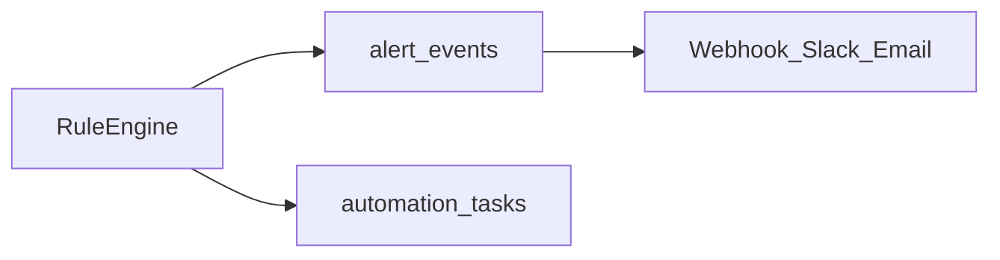

# 업무자동화 설계서 (Phase 2)

> **버전:** v0.1 | **1차:** 화면 미구현 · 본 문서만 제출

---

## 1. 목적

경영 대시보드의 **분석 결과를 실행 가능한 업무**로 연결합니다.

- KPI 이상·청소 미실시·VOC 급증을 **자동 감지**
- 담당자별 **할 일·체크리스트** 생성
- (2차) 이메일·Slack 알림, 월간보고서 PDF 초안

---

## 2. 범위

### 2.1 Phase 1 (현재)

| 항목 | 상태 |
|------|------|
| 업무자동화 탭 UI | 미구현 |
| 규칙 엔진 (일부) | `lib/ax_insights.py`, `kpi_category_alerts` |
| 본 설계서 | 제출용 별첨 |

### 2.2 Phase 2 (MVP)

| 항목 | 우선순위 |
|------|----------|
| 일일 점검 3건 자동 제안 | P0 |
| 주간 운영 체크리스트 | P1 |
| 알림 로그 (DB persist) | P1 |
| Slack/이메일 webhook | P2 |
| 월간 PDF 초안 | P2 |

---

## 3. 탭 설계 (`?tab=automation`)

### 3.1 화면 레이아웃

```
┌─────────────────────────────────────────────┐
│ 업무자동화                                    │
├─────────────────────────────────────────────┤
│ [오늘 할 일]  KPI alert + room + VOC → 3건   │
├─────────────────────────────────────────────┤
│ [주간 체크리스트]  월~일 운영 루틴             │
├─────────────────────────────────────────────┤
│ [알림 로그]  규칙 발화 이력                   │
├─────────────────────────────────────────────┤
│ [보고서]  월간 PDF 생성 (2차)                 │
└─────────────────────────────────────────────┘
```

### 3.2 입력 · 출력

| 블록 | 입력 | 출력 |
|------|------|------|
| 오늘 할 일 | revenue, rooms, voc, alert_rules | 우선순위 3건 카드 + 완료 체크 |
| 주간 체크리스트 | revenue (주간), rooms | 템플릿 항목 + 자동 체크 상태 |
| 알림 로그 | alert_events | 시간·규칙·severity·확인 여부 |
| 보고서 | revenue, executive_analysis | PDF 다운로드 버튼 |

---

## 4. 규칙 엔진

### 4.1 기존 규칙 (재사용)

| rule_id | 조건 | severity | 출처 |
|---------|------|----------|------|
| `category_mom_drop` | 부문 매출 MoM ≤ -10% | critical | `kpi_category_alerts` |
| `room_not_cleaned` | 청소 미실시 ≥ 1 | warning | `room_cleaning_stats` |
| `facility_voc_room` | VOC 1위 시설노후 + 불량률 ≥ 5% | warning | `ax_insights` |
| `voc_rating_low` | 평균 평점 < 3.5 | info | `voc_summary` |

### 4.2 신규 규칙 (Phase 2)

| rule_id | 조건 | 액션 |
|---------|------|------|
| `weekly_fb_drop` | F&B 주간매출 WoW ≤ -15% | 마케팅팀 태스크 |
| `inspector_backlog` | 검수일 NULL & status=실시 ≥ 5 | 운영팀 태스크 |
| `month_end_report` | 매월 1일 | PDF 보고서 생성 태스크 |

### 4.3 규칙 데이터 모델

```json
{
  "id": "category_mom_drop",
  "name": "부문 매출 급락",
  "threshold_pct": -10,
  "severity": "critical",
  "task_template": "해당 부문 프로모션·운영 점검 회의 소집"
}
```

저장: Phase 2 `alert_rules` 테이블 또는 `config` JSON

---

## 5. 일일 점검 자동화 (상세)

### 5.1 알고리즘

```
1. alerts ← kpi_category_alerts(revenue)
2. room_stats ← room_cleaning_stats(rooms)
3. voc ← voc_summary()
4. tasks ← []
5. if alerts: tasks.append(최우선 alert → 실행 카드)
6. if room_stats.not_cleaned > 0: tasks.append(청소 미실시 N건)
7. if voc.top_complaint: tasks.append(VOC 1위 대응)
8. return tasks[:3]  # 상위 3건
```

### 5.2 출력 카드 예시

| 필드 | 예시 |
|------|------|
| title | F&B 매출 급락 |
| body | 전월 대비 -12.3%. 프로모션 점검 권고 |
| assignee | (수동) 마케팅팀 |
| due | 당일 |
| link | `?tab=performance&category=fb` |

---

## 6. 주간 체크리스트 템플릿

| 요일 | 항목 | 자동 판정 |
|------|------|-----------|
| 월 | 전주 매출 요약 검토 | revenue 집계 |
| 화 | 객실 불량률 주간 리뷰 | rooms 집계 |
| 수 | VOC 키워드 확인 | voc + ai_reviews |
| 목 | 사업부문 MoM 점검 | metrics |
| 금 | 주간 보고서 초안 | executive_analysis |

---

## 7. 데이터 · DB 연동

| 1차 (코드) | 2차 (Supabase) |
|------------|----------------|
| `ALERT_THRESHOLD_PCT` | `alert_rules` 테이블 |
| AX 카드 (비persist) | `alert_events` |
| — | `automation_tasks` |

ERD: [05_ERD_Phase2_아키텍처.md](05_ERD_Phase2_아키텍처.md)

---

## 8. 알림 연동 (Phase 2)



- Webhook URL: 환경변수 `SLACK_WEBHOOK_URL` (optional)
- 빈도: critical 즉시, warning 일 1회 digest

---

## 9. PDF 월간보고서 (Phase 2)

| 섹션 | 데이터 소스 |
|------|-------------|
| 표지 | HOTEL_NAME, 월 |
| KPI 요약 | compute_kpis |
| 월별 실적 | monthly_revenue_table |
| AX 하이라이트 | executive_briefing |
| 전략 권고 | generate_marketing_strategy, generate_operations_strategy |

구현 후보: `weasyprint` (Python) 또는 `@react-pdf/renderer` (Next.js)

---

## 10. 구현 우선순위

| 순서 | 작업 | 산출 |
|------|------|------|
| 1 | `lib/automation.py` 규칙·태스크 생성 | 단위 함수 |
| 2 | Streamlit `?tab=automation` MVP | 3블록 UI |
| 3 | `alert_events` persist | Supabase |
| 4 | Webhook 알림 | 운영 연동 |
| 5 | PDF 보고서 | 다운로드 |

---

## 11. 1차 제출 시 설명 포인트

> "업무자동화 탭은 Phase 2에서 구현 예정이며, 현재는 AX·인사이트 탭의 규칙 기반 권고 카드가 자동화의 프로토타입입니다. 본 설계서에 일일 점검·주간 체크리스트·알림·PDF 로드맵을 정의했습니다."

관련: [01_PRD.md](01_PRD.md) §2.2, [03_화면정의서.md](03_화면정의서.md)
